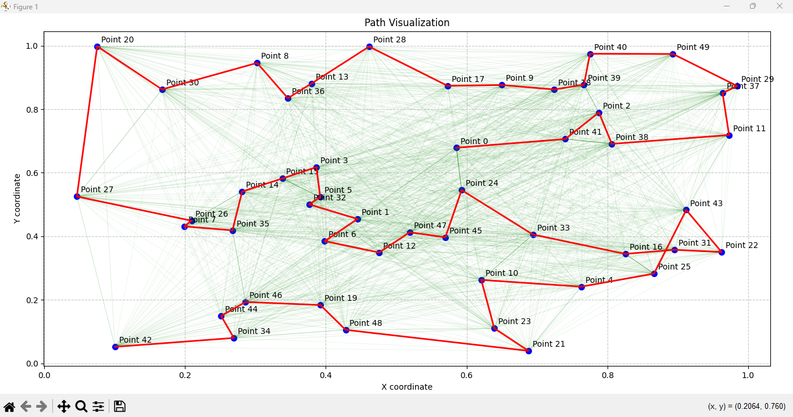
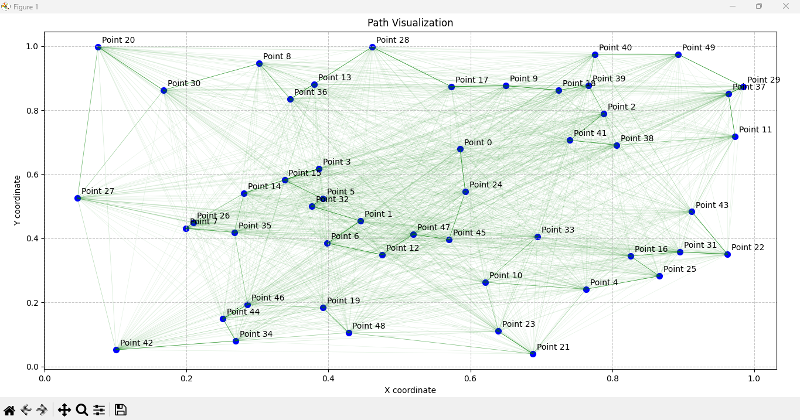
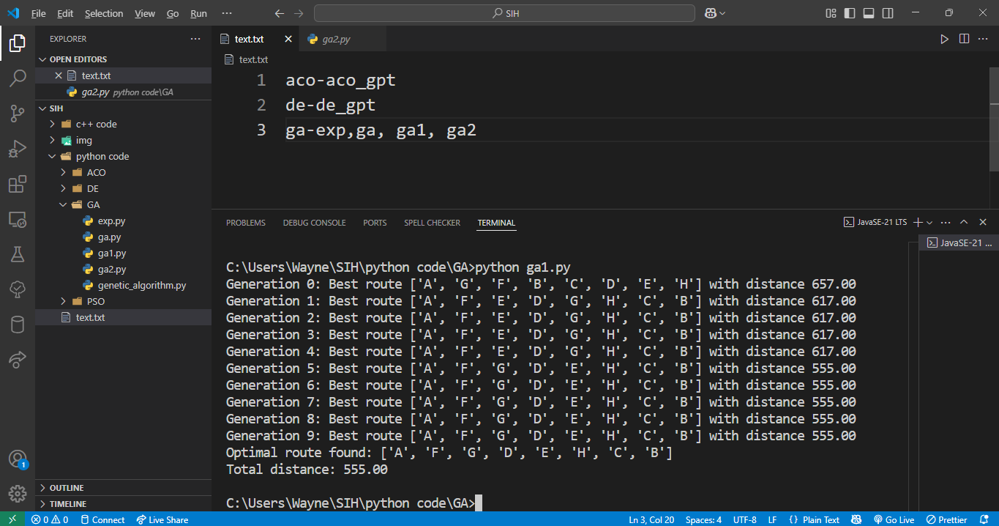
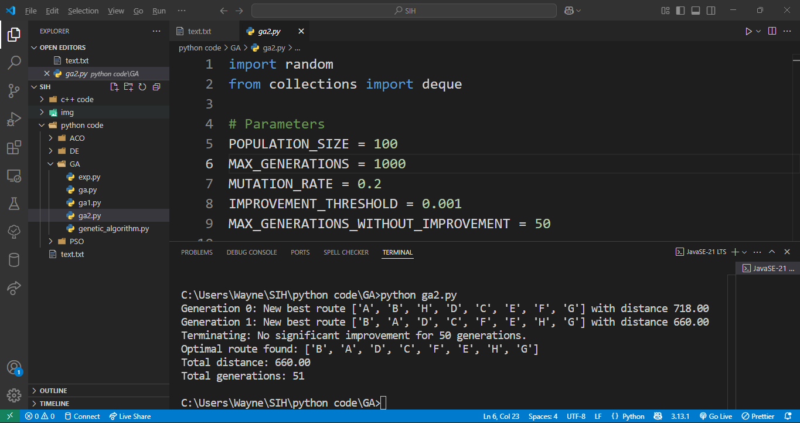
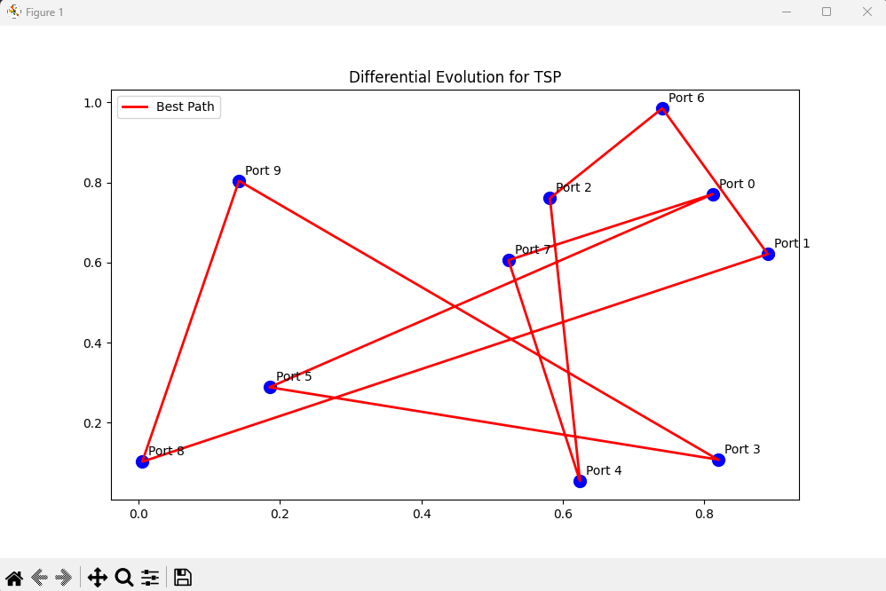
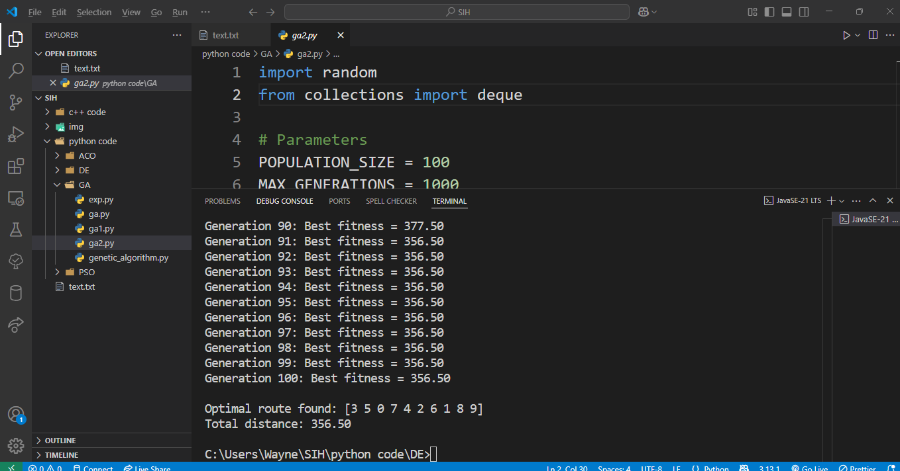

# 🚢 Metaheuristic Algorithms for Route Optimization

[](https://www.python.org/downloads/)
[](https://numpy.org/)
[](https://matplotlib.org/)
[](LICENSE)

> **Solving the Traveling Salesman Problem (TSP)** and similar route optimization challenges using **Ant Colony Optimization (ACO)**, **Genetic Algorithm (GA)**, and **Differential Evolution (DE)**.

---

## 📚 Table of Contents

* 📌 [Overview](#-overview)
* ⚙️ [Algorithms](#-algorithms)
* 🛠️ [Installation](#-installation)
* ▶️ [Usage](#-usage)
* 🧪 [Example Results](#-example-results)
* 📊 [Comparison](#-comparison)
* 🤝 [Contributing](#-contributing)

---

## 🔍 Overview

🚚 **Route Optimization** is vital in logistics, transportation, and AI.
🧠 Metaheuristic algorithms provide intelligent, flexible solutions to such complex problems, especially where traditional methods fall short.

---

## ⚙️ Algorithms

### 🐜 Adaptive Ant Colony Optimization (`aco_gpt.py`)

* 📍 Generates random 2D points
* 🧪 Pheromone-based probabilistic path construction
* 🎯 Finds closest paths to optimal routes
* 📈 Visualizes pheromone intensity and convergence



---

### 🧬 Genetic Algorithm Variants

#### 🧪 Basic GA (`ga1.py`)

* 🎲 Tournament selection
* 🔗 Ordered crossover
* ♻️ Basic mutation operator



#### 🚀 Advanced GA + Two-Opt (`ga2.py`, `exp.py`)

* 🔁 Two-Opt local optimization
* ⚡ Early stopping via improvement threshold
* 🧭 Supports asymmetric distances




#### 🧪 Experimental GA (`ga.py`)

* 🎯 Handles custom waypoints
* ↔️ Manages bidirectional edge weights


---

### 🔄 Differential Evolution (`de_gpt.py`)

* 🔧 Parameter-based mutation strategies
* 👥 Efficient population control
* 📉 Real-time best route visualization



---

## 🛠️ Installation

```bash
# 📦 Clone the repository
git clone https://github.com/yourusername/metaheuristic-route-optimization.git
cd metaheuristic-route-optimization

# 🔧 Install dependencies
pip install numpy matplotlib
```

---

## ▶️ Usage

### 🐜 Ant Colony Optimization

```bash
python aco_gpt.py
```

📝 Prompts:

* Number of points
* Number of ants
* Starting point

---

### 🧬 Genetic Algorithm

```bash
python exp.py
```

🚦Runs with predefined waypoints and genetic parameters.

---

### 🔄 Differential Evolution

```bash
python de_gpt.py
```

📊 Displays best route based on evolving population.

---

## 🧪 Example Results

📌 **Ant Colony Optimization Output:**

```
Iteration  Best Distance      Best Path
-----------------------------------------
   1           2.34         0 → 3 → 1 → 2 → 4
  ...
  10          1.87         0 → 4 → 1 → 3 → 2
-----------------------------------------
✅ Optimization Complete
🏁 Optimal Path: 0 → 4 → 1 → 3 → 2
📏 Total Distance: 1.87
```

---

## 📊 Comparison

| ⚙️ Algorithm | ✅ Advantages                   | ❌ Disadvantages                    | 🧠 Best For                      |
| ------------ | ------------------------------ | ---------------------------------- | -------------------------------- |
| 🐜 ACO       | Adapts to dynamic environments | Needs fine parameter tuning        | Real-time route updates          |
| 🧬 GA        | Easy to implement and adapt    | May get stuck in local optima      | Problems with large search space |
| 🔄 DE        | Excellent for global search    | Slower convergence in early stages | High-precision optimization      |

---

## 🤝 Contributing

We welcome all contributions! 🚀

1. 🍴 Fork the repository
2. 🌿 Create a branch: `git checkout -b feature/amazing-feature`
3. ✅ Commit changes: `git commit -m 'Add amazing feature'`
4. 📤 Push: `git push origin feature/amazing-feature`
5. 📬 Open a Pull Request

---

📫 For feedback or questions, feel free to open an issue or connect!

---
